# VivaTech Solution — Company Profile Website

A multi-page company profile website built with **Laravel's MVC architecture**, developed as part of the Week 3 Laboratory Activity (Mini Project 02) for ITST 302 — Client-Server Technologies.

---

## Table of Contents
1. [Introduction](#1-introduction)
2. [Objectives](#2-objectives)
3. [MVC Architecture](#3-mvc-architecture)
4. [Laravel Routing](#4-laravel-routing)
5. [Controllers](#5-controllers)
6. [Blade Templating Engine](#6-blade-templating-engine)
7. [Laravel Folder Structure](#7-laravel-folder-structure)
8. [Screenshots](#8-screenshots)
9. [Problems Encountered](#9-problems-encountered)
10. [Solutions](#10-solutions)
11. [Reflection](#11-reflection)
12. [References](#12-references)

---

## 1. Introduction

A **Company Profile Website** is an official online representation of a business. It typically introduces the company's identity, history, mission and vision, services, and contact information to potential clients, partners, and the public. Unlike a personal blog or a simple landing page, a company profile website is structured to build credibility and trust — it acts as a digital storefront that is available to visitors at any time.

**Why businesses need one:**
- It establishes an online presence, which is often the first point of contact between a business and a potential client.
- It communicates what the company does, who it serves, and why it can be trusted, without requiring a face-to-face meeting.
- It supports marketing and branding efforts by presenting a consistent, professional image across the web.

**Purpose of this project:**
I built this project to apply Laravel's MVC (Model-View-Controller) architecture in a practical, real-world scenario. Taking on the role of a Junior Laravel Developer, my goal was to build a responsive, multi-page company profile website for a fictional startup — **VivaTech Solution** — while following professional project organization, routing conventions, and reusable Blade templating practices.

---

## 2. Objectives

By completing this project, I was able to:

- Implement Laravel's routing system to handle GET requests for four distinct pages (Home, About, Services, Contact).
- Build a dedicated `CompanyController` to separate request-handling logic from presentation.
- Create reusable Blade layouts and components (`navbar`, `footer`) to avoid duplicating code across pages.
- Apply the `@extends`, `@section`, `@yield`, and `@include` Blade directives to structure the views.
- Design a clean, responsive user interface using Bootstrap 5, customized with a distinct visual identity (custom typography, color palette, and layout system).
- Practice version control by committing my project progress incrementally to a public GitHub repository.
- Document my entire development process, including the challenges I faced and how I solved them, in this README.

---

## 3. MVC Architecture

**What is MVC?**
MVC (Model-View-Controller) is a software design pattern that separates an application into three interconnected components:
- **Model** — represents the data and business logic of the application (e.g., database records).
- **View** — represents what the user sees; in Laravel, this is handled by Blade templates.
- **Controller** — acts as the middleman; it receives requests, processes any necessary logic, and returns a view (often with data) as a response.

**Why Laravel uses MVC:**
Laravel adopts MVC to keep the codebase organized and predictable. Instead of mixing HTML, PHP logic, and database queries in a single file, Laravel separates these concerns so that each part of the application has a clear, single responsibility. This makes the framework easier to learn, extend, and debug.

**Advantages of MVC in software development:**
- **Separation of concerns** — developers can work on the UI (View) without touching business logic (Controller/Model), and vice versa.
- **Reusability** — Views and logic can be reused across different parts of the application.
- **Maintainability** — bugs are easier to isolate because each layer has a distinct role.
- **Scalability** — as an application grows, new features can be added without disrupting the entire codebase.

**MVC Request Flow Diagram:**

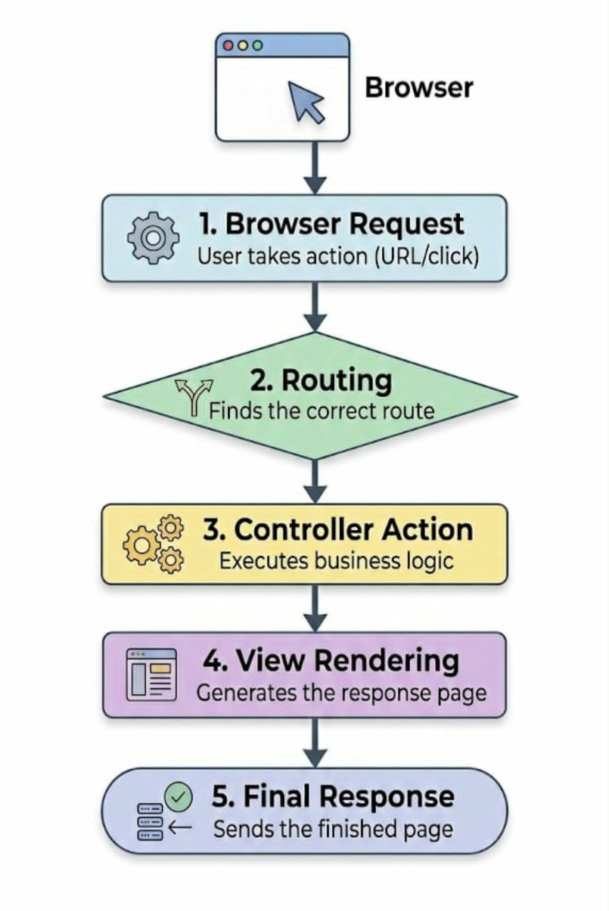

In my project: when a user visits `/about`, Laravel matches the URL to a route I defined in `web.php`, which calls the `about()` method in my `CompanyController`. The controller prepares the data (core values, team members) and returns the `pages.about` Blade view I built, which Laravel compiles into HTML and sends back to the browser.

---

## 4. Laravel Routing

**What is Routing?**
Routing is the mechanism that maps a URL (or "URI") to a specific piece of code — in Laravel's case, a Controller method or a closure. It defines what should happen when a user visits a particular address on the website.

**GET Requests:**
All four routes in this project use `Route::get()`, since each page is simply displaying information to the user (no form submission or data modification is being processed on these routes).

**Named Routes:**
I gave each route a name using `->name()`, such as `->name('home')`. Named routes let other parts of the application (like my Blade views) reference a route by its name — for example, `route('contact')` — instead of hardcoding the URL. This makes the codebase easier to maintain, since changing a URL only requires updating it in one place.

**Route Definitions I used in this project (`routes/web.php`):**

```php
use App\Http\Controllers\CompanyController;

Route::get('/', [CompanyController::class, 'home'])->name('home');
Route::get('/about', [CompanyController::class, 'about'])->name('about');
Route::get('/services', [CompanyController::class, 'services'])->name('services');
Route::get('/contact', [CompanyController::class, 'contact'])->name('contact');
```

**Screenshot — `web.php`:**

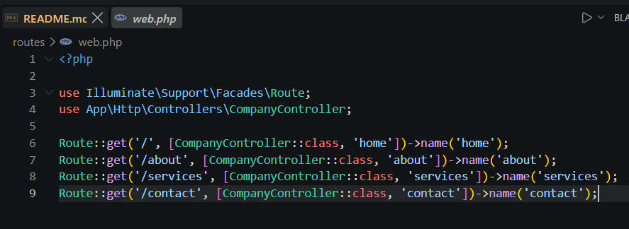

---

## 5. Controllers

**Purpose of Controllers:**
A controller handles the logic that connects a route to a view. Instead of writing business logic directly inside route definitions, Laravel encourages placing that logic in controller classes — keeping the routes file clean and the logic organized and testable.

**Benefits of Controllers:**
- Keeps related logic grouped together (all company-page logic lives in one `CompanyController`).
- Makes the application easier to test and debug.
- Prevents the routes file from becoming cluttered as the application grows.

**Controller Methods:**
My `CompanyController` contains four public methods, each corresponding to a page:

```php
class CompanyController extends Controller
{
    public function home()
    {
        $featuredServices = [ /* ... */ ];
        return view('pages.home', compact('featuredServices'));
    }

    public function about()
    {
        $coreValues = [ /* ... */ ];
        $team = [ /* ... */ ];
        return view('pages.about', compact('coreValues', 'team'));
    }

    public function services()
    {
        $services = [ /* ... */ ];
        return view('pages.services', compact('services'));
    }

    public function contact()
    {
        $companyInfo = [ /* ... */ ];
        return view('pages.contact', compact('companyInfo'));
    }
}
```

Each method prepares the data needed by its corresponding page and passes it to a Blade view using the `compact()` helper, which converts variables into an associative array automatically matched by variable name.

**Screenshot — `CompanyController.php`:**

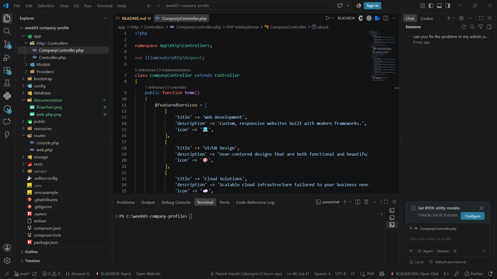

---

## 6. Blade Templating Engine

Blade is Laravel's built-in templating engine. It allows PHP logic to be written inside HTML using clean, readable syntax, and it compiles into plain PHP for fast execution.

**Blade Layouts:**
A layout is a "master" HTML template that defines the overall page structure — the `<head>`, navigation, footer, and a placeholder for page-specific content. I used a single layout file, `layouts/app.blade.php`, shared by all four pages.

**Blade Components:**
I separated reusable pieces of the interface — the navigation bar and footer — into their own files inside `resources/views/components/` and inserted them wherever needed using `@include`.

**Key Directives Used:**

| Directive | Purpose |
|---|---|
| `@extends('layouts.app')` | Tells a page that it should inherit the structure of the main layout. |
| `@section('content')` ... `@endsection` | Defines the content block that will be inserted into the layout's `@yield`. |
| `@yield('content')` | Placed inside the layout; marks where the page-specific content will be injected. |
| `@include('components.navbar')` | Inserts a reusable Blade component directly into a page or layout. |

**Example — `pages/home.blade.php`:**

```blade
@extends('layouts.app')

@section('title', 'Home')

@section('content')
    <section class="hero-texture py-5 mt-4">
        <h1>Smart, modern technology built for growing businesses.</h1>
    </section>
@endsection
```

**Example — `layouts/app.blade.php`:**

```blade
<body>
    @include('components.navbar')

    <main>
        @yield('content')
    </main>

    @include('components.footer')
</body>
```

**Screenshot — Blade Layout:**

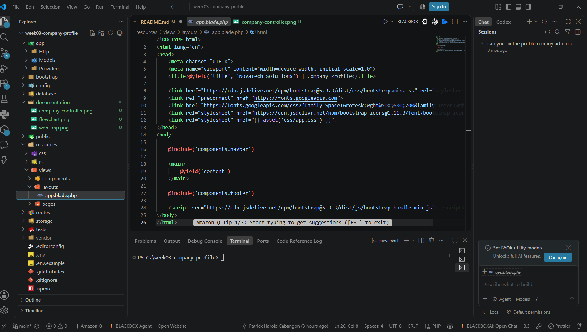


---

## 7. Laravel Folder Structure

| Folder | Purpose |
|---|---|
| `app/` | Contains the core application code, including Controllers, Models, and Providers. This is where the application's business logic lives. |
| `routes/` | Contains route definition files (`web.php`, `console.php`) that map URLs to controller actions. |
| `resources/` | Contains uncompiled assets and Blade view files — the `views/` subfolder holds all layouts, components, and pages used in this project. |
| `public/` | The web server's document root. Contains the entry point (`index.php`), compiled assets, and publicly accessible files like images and custom CSS. |
| `bootstrap/` | Contains the files that bootstrap (initialize) the framework, including the application cache files generated by Laravel for performance. |
| `config/` | Contains all of the application's configuration files, such as database, session, and mail settings. |

---

## 8. Screenshots

| Page/Item | Screenshot |
|---|---|
| Home Page | 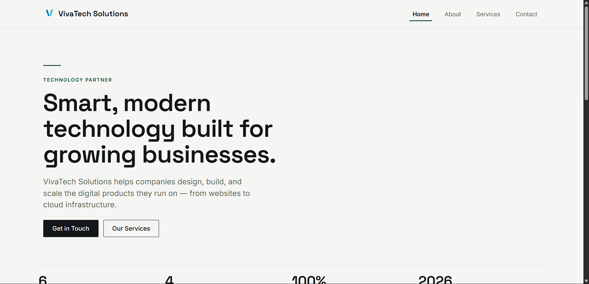 |
| About Page | 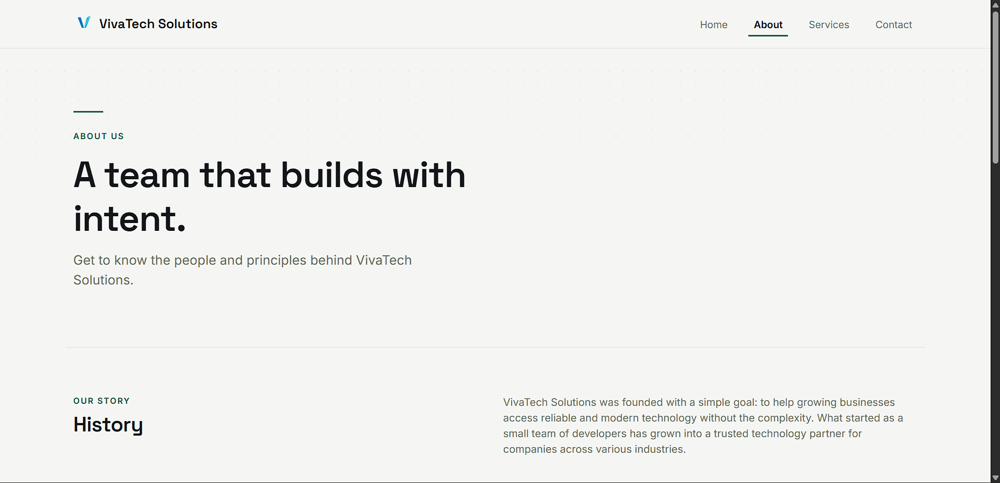 |
| Services Page | 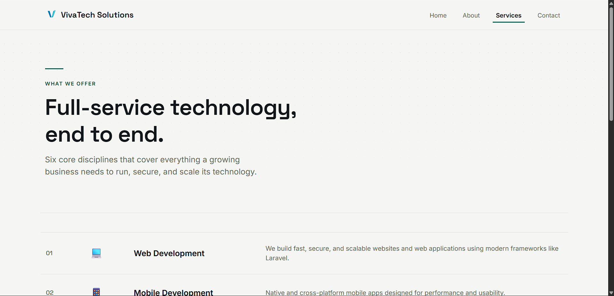 |
| Contact Page | 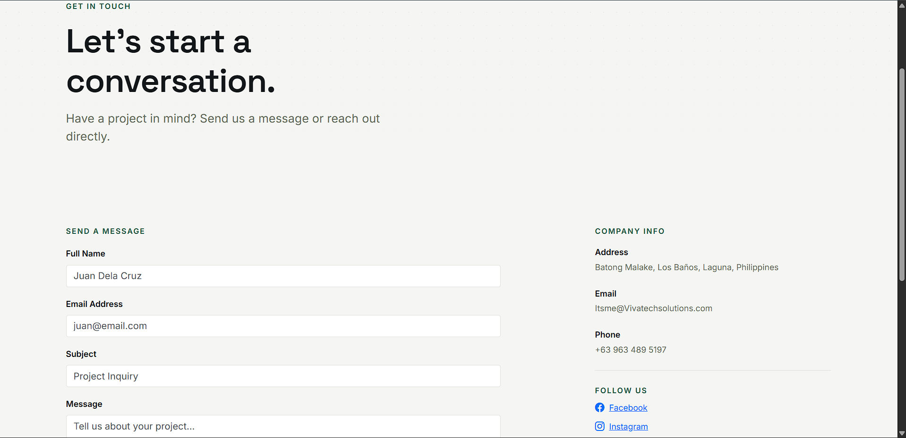 |
| Navigation Bar |  |
| Footer | 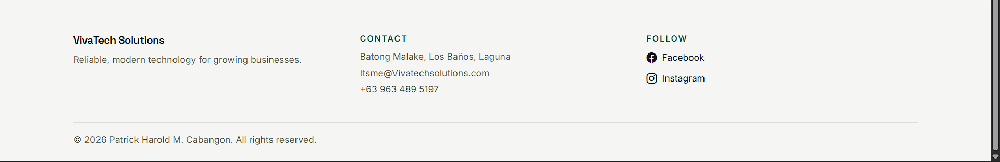 |
| Route Definitions |  |
| Controller |  |
| Blade Layout |  ||
| VS code Project | 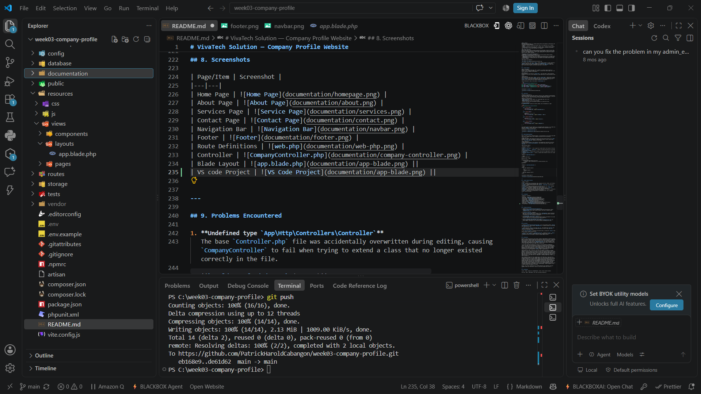 ||
| laravel Folder | 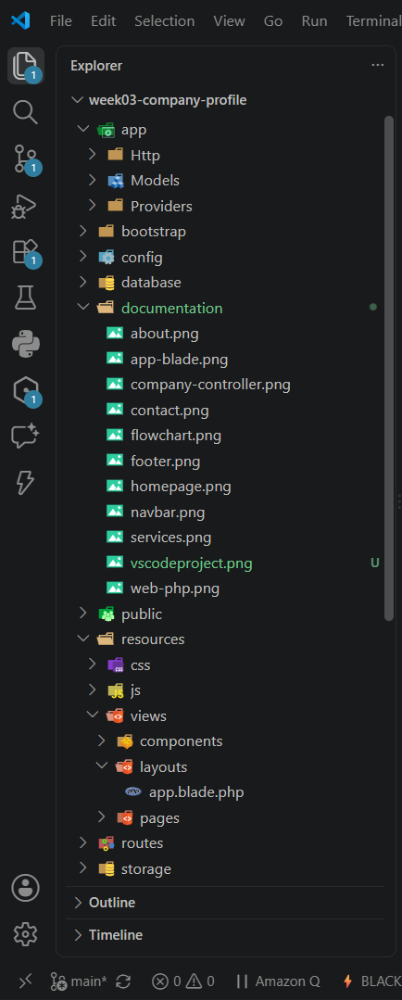 ||
| Github Repository | 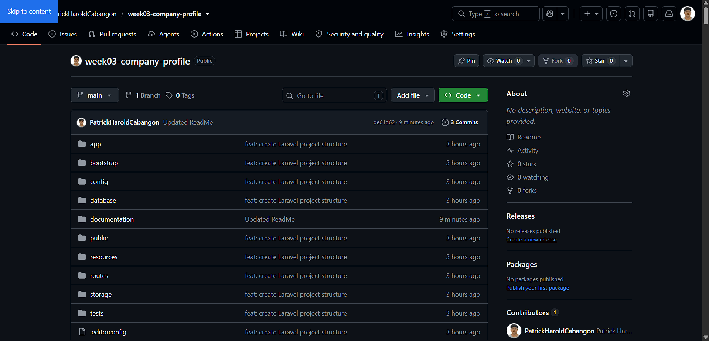 ||
| Browser Output | 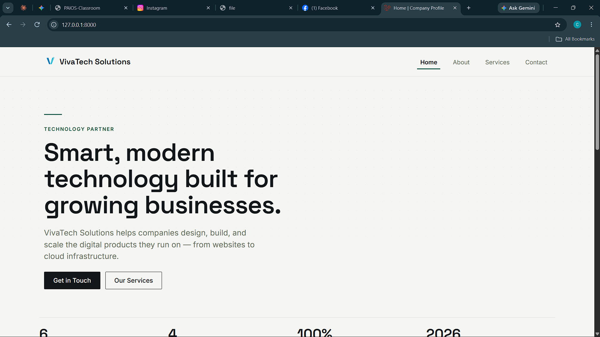 ||


---

## 9. Problems Encountered

1. **Undefined type `App\Http\Controllers\Controller`**
   The base `Controller.php` file was accidentally overwritten during editing, causing `CompanyController` to fail when trying to extend a class that no longer existed correctly in the file.

2. **`could not find driver` (SQLite)**
   When first running the application, Laravel threw a `QueryException` because the SQLite PHP extension (`pdo_sqlite`) was not enabled in the local PHP installation, preventing the session driver from connecting to the database.

3. **`SQLSTATE[HY000]: no such table: sessions`**
   After enabling the SQLite driver, a new error appeared because the database file existed but had no tables yet — the required migrations had not been run.

4. **`Call to undefined method CompanyController::home()`**
   While fixing the base Controller file, the contents of `CompanyController.php` were briefly emptied, removing all four controller methods and breaking every route.

---

## 10. Solutions

1. Restored `app/Http/Controllers/Controller.php` to its correct default content (`abstract class Controller {}`), which allowed `CompanyController` to properly extend it and resolved the "undefined type" error.

2. Located the active `php.ini` file using `php --ini`, then enabled the `pdo_sqlite` and `sqlite3` extensions by removing the leading semicolons in front of those lines, and restarted the development server.

3. Ran `php artisan migrate` to generate the required tables, including the `sessions` table used by Laravel's default session driver.

4. Restored the full contents of `CompanyController.php`, re-adding the `home()`, `about()`, `services()`, and `contact()` methods along with their respective data arrays, then re-tested each route in the browser to confirm all pages loaded correctly.

---

## 11. Reflection

Working on this project gave me a much clearer, hands-on understanding of what MVC actually means in practice, beyond just memorizing the definition. Before this activity, I understood MVC as an abstract concept — Model, View, Controller — but I had not really felt *why* it mattered until I ran into real errors that only made sense once I understood how the three layers depend on each other. When my `CompanyController.php` file lost its methods, every single route broke immediately, and that made it obvious just how central the Controller is as the bridge between a URL and the page a user actually sees.

I also came to appreciate separation of concerns in a very concrete way. Keeping the routing, the logic, and the presentation in separate files meant that when something went wrong, I could usually narrow down the problem quickly by asking which layer it belonged to. Was it a routing issue? A controller issue? A Blade syntax issue? This structure turned debugging from a guessing game into a more systematic process. It also made the codebase much easier to read — anyone opening `web.php` immediately understands what pages exist, without needing to read through HTML or business logic to figure that out.

Understanding how routes, controllers, and views work together was probably the biggest takeaway. A route is really just an address — it does not do any actual work on its own. It points to a controller method, which is where the real logic happens: preparing data, making decisions, and deciding what should be shown. The controller then hands that data off to a Blade view, whose only job is to display it. Seeing this flow play out across four different pages, each with its own data (services, team members, company information), helped me internalize that a view should never be responsible for deciding *what* data to show — only *how* to display it.

This architecture becomes even more valuable when I think about how it could scale to a larger enterprise system. In a real company website — or a much larger application like an e-commerce platform or an internal business system — there could be dozens or even hundreds of routes and controllers. Without a clear separation between logic and presentation, a codebase like that would quickly become unmanageable. MVC provides a shared structure that multiple developers can work within simultaneously: one person could focus on building out controller logic and business rules, while another works purely on the Blade views and front-end design, without stepping on each other's work. Reusable components, like the navbar and footer built in this project, also hint at how much repetition MVC saves at scale — instead of duplicating the same HTML across a hundred pages, a single component can be included everywhere and updated in one place.

Overall, this project shifted MVC from a textbook definition into something I have now debugged, broken, and fixed myself — which is a much more durable way to learn it.

---

## 12. References

Laravel. (2025). *Laravel 12.x documentation*. Laravel. https://laravel.com/docs

PHP Group. (2025). *PHP manual*. PHP. https://www.php.net/manual/en/

Mozilla Developer Network. (2025). *MDN Web Docs*. Mozilla. https://developer.mozilla.org/en-US/

Bootstrap. (2025). *Bootstrap documentation*. Bootstrap. https://getbootstrap.com/docs/

Bootstrap. (2025). *Bootstrap Icons*. Bootstrap. https://icons.getbootstrap.com/